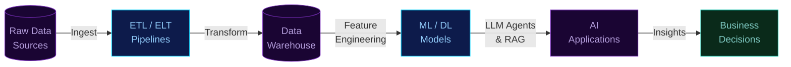

  

  

  
  &nbsp;
  
  &nbsp;
  

 

---

## The Pipeline

> *Every AI product starts with clean, reliable data — I build both ends.*

---

## About Me

MSc Advanced Data Science & AI student at the **University of Liverpool**, with industry experience building production-grade AI and ML solutions. I work across the full data stack — from **ingestion pipelines and data modelling** to **LLM agents, RAG architectures, and ML deployment**.

- MSc Advanced Data Science & AI — University of Liverpool (2026–2027)
- Ex Senior Executive, Data AI & Automation — [24]7.ai 
- Published researcher — IJRPR Journal
- Learning now: dbt · Apache Spark · Airflow · LLM Ops
- Open to: **Data Engineer / AI Engineer** roles

 

---

## Tech Stack

<table>
  <tr>
    <th align="left" width="200">Layer</th>
    <th align="left">Tools & Frameworks</th>
  </tr>
  <tr>
    <td><b>Languages</b></td>
    <td>
      
      
    </td>
  </tr>
  <tr>
    <td><b>Data Engineering</b></td>
    <td>
      
      
      
      
      
      
    </td>
  </tr>
  <tr>
    <td><b>LLM & Gen AI</b></td>
    <td>
      
      
      
      
      
      
    </td>
  </tr>
  <tr>
    <td><b>ML & Deep Learning</b></td>
    <td>
      
      
      
      
      
      
    </td>
  </tr>
  <tr>
    <td><b>NLP</b></td>
    <td>
      
      
      
    </td>
  </tr>
  <tr>
    <td><b>Cloud & BI</b></td>
    <td>
      
      
      
      
    </td>
  </tr>
</table>

---

## Featured Projects

<table>
  <tr>
    <td width="50%" valign="top" style="border: 1px solid #7B2FBE; border-radius: 6px; padding: 12px;">
      <h3>AI Research Assistant</h3>
      LLM-Powered Literature Summarisation — 2025  
      
      
      
      
        
      Agentic pipeline that retrieves, summarises, and synthesises academic papers from a natural-language query. RAG architecture grounds LLM responses in real sources — reducing hallucination, improving reliability.
    </td>
    <td width="50%" valign="top">
      <h3>Agentic Data Analyst</h3>
      Automated Business Insights Tool — 2025  
      
      
      
        
      AI agent that accepts a business question in plain English, autonomously selects analysis steps, executes Python code, and returns a structured insight report with visualisations.
    </td>
  </tr>
  <tr>
    <td width="50%" valign="top">
      <h3>Hybrid ML — Crop Yield Prediction</h3>
      Dec 2022 – Jun 2023  
      
      
      
      
        
      Ensemble model integrating four environmental datasets achieving <b>R² of 98.3%</b>. Deployed via Gradio web app for non-technical end users.
    </td>
    <td width="50%" valign="top">
      <h3>Image Classification on AWS Cloud</h3>
      Jul 2023 – Nov 2023  
      
      
      
        
      Trained and deployed a CNN on AWS SageMaker with real-time API integration achieving <b>85% accuracy</b>. Auto-scaling configured for cost-efficient production deployment.
    </td>
  </tr>
  <tr>
    <td width="50%" valign="top">
      <h3>Face Mask Detection — YOLOv5</h3>
      Jan 2021 – Oct 2022  
      
      
        
      Real-time object detection pipeline classifying mask compliance from live video feeds using single-stage detection for high-speed, production-grade inference.
    </td>
    <td width="50%" valign="top">
      <h3>SQL Journey for Data Engineering</h3>
      Active — Daily Practice  
      
      
      
        
      Daily SQL practice — joins, CTEs, window functions, aggregations, views, indexing, and star schema design.
        
      
    </td>
  </tr>
</table>

---

## GitHub Activity

  
  

  

---

## Education

| Degree | Institution | Period |
|--------|-------------|--------|
| MSc Advanced Data Science & Artificial Intelligence | University of Liverpool, UK | Jan 2026 – Jan 2027 |
| B.Tech Computer Engineering (Data Science) | Presidency University, Bengaluru, India | Aug 2019 – Jul 2023 |

**MSc Modules:** Machine Learning · Deep Learning · NLP · Big Data Analytics · Statistical Modelling · Data Visualisation · AI Ethics & Governance

---

## Certifications

| Certification | Issuer |
|---------------|--------|
| Ethics of Data Analytics | Presidency University |
| Introduction to Data Science | DataCamp |
| Junior Software Developer | NASSCOM |

---

  

  
  &nbsp;
  

